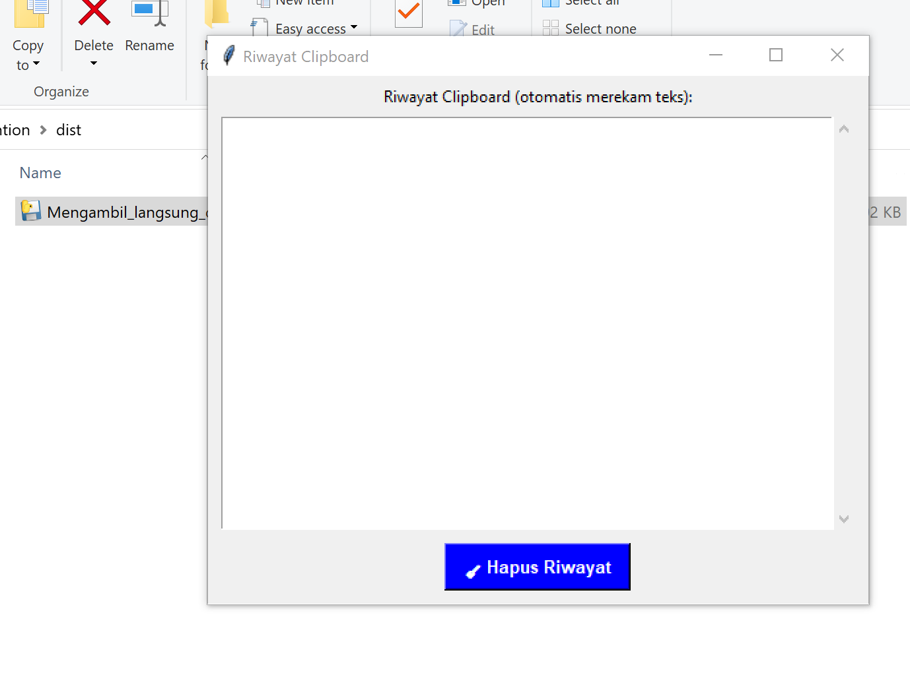

#### Jalankan file .exe yang ada di folder `dist` untuk langsung menggunakan perangkat lunak ini.
#### قم بتشغيل ملف .exe الموجود في مجلد `dist` لبدء استخدام البرنامج.
#### Run the .exe file in the `dist` folder to start using the software.
#### 在 `dist` 文件夹中运行 .exe 文件以开始使用该软件。

## 🇮🇩 Bahasa Indonesia

Ini adalah perangkat lunak yang dirancang untuk menyalin teks dan secara otomatis menempelkannya pada papan tulis yang telah disediakan. Jika teks yang disalin sama dengan teks yang sebelumnya telah disalin, maka penempelan tidak akan terjadi. Hal ini bertujuan untuk mencegah terjadinya duplikasi akibat penekanan tombol ganda.

## 🇺🇸 English

This software is designed to copy text and automatically paste it onto the provided whiteboard. If the copied text is identical to the previously copied text, pasting will not occur. This is intended to prevent duplication caused by accidental double key presses.

## 🇸🇦 العربية

هذا البرنامج مصمم لنسخ النص ولصقه تلقائيًا على السبورة المقدمة. إذا كان النص المنسوخ مطابقًا للنص المنسوخ سابقًا، فلن يحدث اللصق. يهدف ذلك إلى منع التكرار الناجم عن الضغط المزدوج على الأزرار.

## 🇨🇳 中文

此软件旨在复制文本并自动将其粘贴到提供的白板上。如果复制的文本与先前复制的文本相同，则不会发生粘贴。此设计旨在防止因意外双击键而导致的重复。
